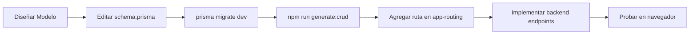

# 📘 GUÍA DE AUTO-GENERACIÓN DE FRONTEND

## Introducción

Este documento es una guía práctica para desarrolladores que quieren generar automáticamente componentes frontend a partir del schema Prisma del backend.

## ¿Qué hace este generador?

🎯 **Objetivo**: Generar automáticamente todo el código frontend necesario para un CRUD completo, leyendo el archivo `schema.prisma` del backend.

🚀 **Resultado**: Con un solo comando (`npm run generate:crud`), obtienes:
- ✅ Interfaces TypeScript para todos tus modelos
- ✅ Servicios Angular con operaciones CRUD
- ✅ Componentes de tabla (listado)
- ✅ Componentes de creación
- ✅ Componentes de edición
- ✅ Módulos Angular configurados
- ✅ Routing completo

## Requisitos Previos

### 1. Instalaciones Necesarias
```bash
# En la raíz del proyecto
npm install

# Verificar versiones
node --version  # >= 18.0.0
npm --version   # >= 9.0.0
```

### 2. Estructura Requerida
```
anfutrans-platform/
├── apps/
│   ├── backend/
│   │   └── prisma/
│   │       └── schema.prisma  ← Source of truth
│   └── frontend/
│       └── src/
│           └── app/
│               ├── shared/
│               │   └── models/        ← Aquí se generan interfaces
│               └── modules/           ← Aquí se generan componentes
└── tools/
    └── prisma-generator/              ← Generador
```

## Uso Básico

### Comando Principal

```bash
npm run generate:crud
```

Este comando:
1. Lee `apps/backend/prisma/schema.prisma`
2. Extrae todos los modelos
3. Genera código frontend automáticamente
4. Crea archivos en `apps/frontend/src/app/`

### Output Esperado

```
🚀 Iniciando generación automática de CRUD...

📖 Leyendo schema.prisma...
✅ 18 modelos encontrados

🔧 Generando modelos TypeScript...
  ✓ socio.model.ts
  ✓ solicitud.model.ts
  ✓ beneficio.model.ts
  ...
✅ 18 modelos generados

🔧 Generando servicios Angular...
  ✓ socios/socio.service.ts
  ✓ solicitudes/solicitud.service.ts
  ...
✅ 18 servicios generados

🔧 Generando componentes CRUD...
  ✓ socios/socio-table/
  ✓ socios/socio-create/
  ✓ socios/socio-edit/
  ...
✅ 54 componentes generados (tabla + create + edit)

🔧 Generando módulos y routing...
  ✓ socios.module.ts + routing
  ...
✅ 18 módulos generados

✨ ¡Generación completada exitosamente!

📊 Resumen:
   - 18 modelos TypeScript
   - 18 servicios Angular
   - 54 componentes (tabla, create, edit)
   - 18 módulos con routing
```

## Ejemplos Prácticos

### Ejemplo 1: Agregar Nuevo Modelo

#### Paso 1: Definir modelo en Prisma

Editar `apps/backend/prisma/schema.prisma`:

```prisma
model evento {
  id          String   @id @default(uuid()) @db.Uuid
  nombre      String
  descripcion String?
  fecha       DateTime
  lugar       String
  capacidad   Int
  createdAt   DateTime @default(now())
  updatedAt   DateTime @updatedAt

  @@schema("core")
}
```

#### Paso 2: Migrar la base de datos

```bash
cd apps/backend
npx prisma migrate dev --name add-evento-model
```

#### Paso 3: Generar frontend

```bash
cd ../..  # Volver a la raíz
npm run generate:crud
```

#### Resultado

Se crean automáticamente:

```
apps/frontend/src/app/
├── shared/models/
│   └── evento.model.ts
└── modules/eventos/
    ├── eventos.module.ts
    ├── eventos-routing.module.ts
    ├── evento.service.ts
    ├── evento-table/
    │   ├── evento-table.component.ts
    │   ├── evento-table.component.html
    │   └── evento-table.component.scss
    ├── evento-create/
    │   ├── evento-create.component.ts
    │   ├── evento-create.component.html
    │   └── evento-create.component.scss
    └── evento-edit/
        ├── evento-edit.component.ts
        ├── evento-edit.component.html
        └── evento-edit.component.scss
```

**Interface generada** (`evento.model.ts`):
```typescript
export interface Evento {
  id: string;
  nombre: string;
  descripcion?: string;
  fecha: Date | string;
  lugar: string;
  capacidad: number;
  createdAt?: Date | string;
  updatedAt?: Date | string;
}
```

**Service generado** (`evento.service.ts`):
```typescript
@Injectable({ providedIn: 'root' })
export class EventoService {
  constructor(private apiService: ApiService) {}

  getAll(): Observable<Evento[]> {
    return this.apiService.get<Evento[]>('/eventos');
  }

  getById(id: string): Observable<Evento> {
    return this.apiService.get<Evento>(`/eventos/${id}`);
  }

  create(data: Partial<Evento>): Observable<Evento> {
    return this.apiService.post<Evento>('/eventos', data);
  }

  update(id: string, data: Partial<Evento>): Observable<Evento> {
    return this.apiService.put<Evento>(`/eventos/${id}`, data);
  }

  delete(id: string): Observable<void> {
    return this.apiService.delete<void>(`/eventos/${id}`);
  }
}
```

#### Paso 4: Agregar ruta al app-routing

Editar `apps/frontend/src/app/app-routing.module.ts`:

```typescript
const routes: Routes = [
  // ... rutas existentes
  {
    path: 'eventos',
    loadChildren: () => import('./modules/eventos/eventos.module')
      .then(m => m.EventosModule)
  }
];
```

#### Paso 5: Probar

```bash
cd apps/frontend
npm start
```

Navegar a: `http://localhost:4200/eventos`

### Ejemplo 2: Modificar Campo Existente

#### Escenario
Queremos cambiar el campo `telefono` del modelo `socio` de `String` a `Int`.

#### Paso 1: Actualizar schema

```prisma
model socio {
  id       String @id @default(uuid()) @db.Uuid
  rut      String @unique
  nombre   String
  apellido String
  email    String?
  telefono Int?    // ← Cambio: antes era String
  // ... resto de campos
}
```

#### Paso 2: Migrar

```bash
cd apps/backend
npx prisma migrate dev --name change-telefono-to-int
```

#### Paso 3: Regenerar frontend

```bash
cd ../..
npm run generate:crud
```

✅ La interface `Socio` se actualiza automáticamente:

```typescript
export interface Socio {
  // ... otros campos
  telefono?: number;  // ← Actualizado automáticamente
}
```

✅ Los formularios también se actualizan con `type="number"`.

### Ejemplo 3: Workflow Completo de Desarrollo



#### Comandos en Secuencia

```bash
# 1. Editar schema.prisma
code apps/backend/prisma/schema.prisma

# 2. Migrar base de datos
cd apps/backend
npx prisma migrate dev --name mi-nueva-feature

# 3. Generar código Prisma
npx prisma generate

# 4. Volver a raíz y generar frontend
cd ../..
npm run generate:crud

# 5. Verificar archivos generados
git status

# 6. Iniciar desarrollo
npm run frontend:dev  # Terminal 1
npm run backend:dev   # Terminal 2
```

## Personalización Post-Generación

### Modificar Validaciones

Los formularios generados tienen validaciones básicas. Para agregar más:

```typescript
// Editar: apps/frontend/src/app/modules/socios/socio-create/socio-create.component.ts

this.form = this.fb.group({
  rut: ['', [
    Validators.required,
    Validators.pattern(/^\d{7,8}-[\dkK]$/)  // ← Agregar validación RUT
  ]],
  email: ['', [
    Validators.email  // ← Agregar validación email
  ]],
  // ... demás campos
});
```

### Personalizar Columnas de Tabla

```typescript
// Editar: apps/frontend/src/app/modules/socios/socio-table/socio-table.component.html

<app-data-table
  [data]="data"
  [columns]="['rut', 'nombre', 'apellido', 'email', 'telefono']"  // ← Agregar columnas
  (edit)="onEdit($event)"
  (delete)="onDelete($event)">
</app-data-table>
```

### Agregar Filtros

```typescript
// Editar: socio-table.component.ts

export class SocioTable implements OnInit {
  data: Socio[] = [];
  filteredData: Socio[] = [];
  searchTerm = '';

  applyFilter(term: string) {
    this.filteredData = this.data.filter(socio =>
      socio.nombre.toLowerCase().includes(term.toLowerCase()) ||
      socio.apellido.toLowerCase().includes(term.toLowerCase())
    );
  }
}
```

```html
<!-- Editar: socio-table.component.html -->

<mat-form-field>
  <input matInput placeholder="Buscar..." [(ngModel)]="searchTerm" (input)="applyFilter($event.target.value)">
</mat-form-field>

<app-data-table [data]="filteredData" ...>
```

## Mejores Prácticas

### ✅ Hacer

1. **Regenerar después de cambios en schema**
   ```bash
   npm run generate:crud
   ```

2. **Usar Git para revisar cambios**
   ```bash
   git diff apps/frontend/src/app/shared/models/
   git diff apps/frontend/src/app/modules/
   ```

3. **Agregar personalizaciones DESPUÉS de generar**
   - Primero genera código base
   - Luego agrega validaciones custom
   - Finalmente personaliza UI

4. **Mantener sincronizado**
   - Backend cambia → Regenerar frontend
   - Schema es la única fuente de verdad

### ❌ Evitar

1. **No editar archivos generados directamente** (se sobrescribirán)
   - Si necesitas personalizar, hazlo en capas superiores
   - O modifica los templates en `tools/prisma-generator/templates/`

2. **No generar en producción**
   - Solo en desarrollo
   - Commitear archivos generados

3. **No ignorar errores de migración**
   ```bash
   # ❌ Malo
   npm run generate:crud  # Sin migrar primero

   # ✅ Bueno
   cd apps/backend
   npx prisma migrate dev
   cd ../..
   npm run generate:crud
   ```

## Troubleshooting

### Problema: "No se generan archivos"

**Solución**:
```bash
# Verificar que existe el schema
ls apps/backend/prisma/schema.prisma

# Verificar estructura de carpetas
ls apps/frontend/src/app/shared/models/
ls apps/frontend/src/app/modules/
```

### Problema: "Error: Cannot find module 'ts-node'"

**Solución**:
```bash
npm install
```

### Problema: "Tipos no coinciden entre backend y frontend"

**Solución**:
```bash
# Regenerar todo desde cero
cd apps/backend
npx prisma generate
cd ../..
npm run generate:crud
```

### Problema: "Formulario no valida campos requeridos"

**Causa**: Campo marcado como opcional en Prisma (`?`)

**Solución**:
```prisma
model socio {
  nombre String   # Sin ?, es requerido
  email  String?  # Con ?, es opcional
}
```

## Scripts Disponibles

```json
{
  "generate:crud": "Genera CRUD frontend desde schema.prisma",
  "backend:dev": "Inicia backend NestJS en modo desarrollo",
  "frontend:dev": "Inicia frontend Angular en modo desarrollo",
  "install:all": "Instala dependencias en todos los proyectos",
  "prisma:generate": "Genera cliente Prisma",
  "prisma:migrate": "Ejecuta migraciones de Prisma"
}
```

### Uso de Scripts

```bash
# Generar frontend
npm run generate:crud

# Iniciar desarrollo completo
npm run backend:dev & npm run frontend:dev

# Instalar dependencias
npm run install:all

# Migraciones
npm run prisma:migrate
```

## Workflow Git Recomendado

### Feature completa con generación

```bash
# 1. Crear rama de feature
git checkout -b feature/nuevo-modulo-eventos

# 2. Modificar schema
code apps/backend/prisma/schema.prisma

# 3. Migrar
cd apps/backend
npx prisma migrate dev --name add-eventos
cd ../..

# 4. Generar frontend
npm run generate:crud

# 5. Revisar cambios
git status
git diff

# 6. Commit
git add .
git commit -m "feat: agregar módulo de eventos con CRUD completo"

# 7. Push
git push origin feature/nuevo-modulo-eventos

# 8. Tag (opcional)
git tag v0.5.1-eventos
git push --tags
```

## Preguntas Frecuentes (FAQ)

### ¿Puedo generar solo un modelo específico?

**Respuesta**: Actualmente no. El generador procesa todos los modelos. Versiones futuras incluirán selección interactiva.

**Workaround**: Genera todo y luego borra lo que no necesites.

### ¿Qué pasa con las relaciones?

**Respuesta**: El generador actual OMITE campos de relación en formularios. Solo genera campos escalares.

**Ejemplo**:
```prisma
model solicitud {
  id      String @id @default(uuid())
  socioId String  // ← Se genera en formulario
  socio   socio  @relation(...) // ← Se omite
}
```

**Para relaciones**: Debes agregar manualmente dropdowns o autocompletes.

### ¿Puedo modificar los templates?

**Sí**. Edita archivos en `tools/prisma-generator/templates/`:

```typescript
// tools/prisma-generator/templates/service.template.ts

export function generateServiceTemplate(model: PrismaModel): string {
  return `
    // Tu código personalizado aquí
  `;
}
```

Luego ejecuta `npm run generate:crud` para aplicar cambios.

### ¿Funciona con otros ORMs?

**No**. Está diseñado específicamente para Prisma. Para otros ORMs (TypeORM, Sequelize) necesitarías adaptar el parser.

## Recursos Adicionales

- 📖 [PRISMA-CRUD-GENERATOR.md](./PRISMA-CRUD-GENERATOR.md) - Documentación técnica completa
- 🏗️ [arquitectura-backend.md](./arquitectura-backend.md) - Arquitectura del backend
- 📝 [Prisma Schema Reference](https://www.prisma.io/docs/reference/api-reference/prisma-schema-reference)
- 🎨 [Angular Material Components](https://material.angular.io/components/categories)

## Soporte

Si encuentras problemas:

1. Revisa esta guía
2. Consulta [PRISMA-CRUD-GENERATOR.md](./PRISMA-CRUD-GENERATOR.md)
3. Verifica los logs en consola

---

**¡Feliz Desarrollo Automatizado! 🚀**

ANFUTRANS Development Team - 2025
