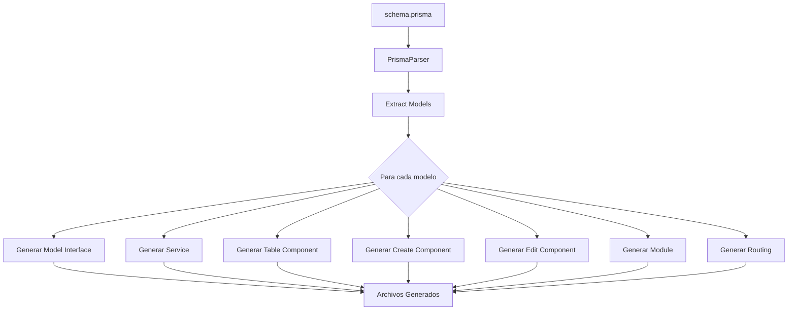

# 🚀 PRISMA CRUD GENERATOR

## Descripción General

Sistema de generación automática de código frontend a partir del schema Prisma del backend. Este generador lee el archivo `schema.prisma` y genera automáticamente todos los componentes, servicios, modelos y routing necesarios para un CRUD completo en Angular.

## Arquitectura del Sistema

### Flujo del Generador



### Componentes Principales

#### 1. **PrismaParser** (`parse-prisma.ts`)
**Responsabilidad**: Leer y parsear el schema.prisma

**Características**:
- Extrae modelos usando expresiones regulares
- Mapea tipos Prisma → TypeScript
- Identifica campos escalares vs relaciones
- Genera nombres en múltiples formatos (PascalCase, camelCase, kebab-case, plural)

**Output**: Array de `PrismaModel` con metadata completa

```typescript
interface PrismaModel {
  name: string              // Nombre original (snake_case)
  pascalName: string        // CargoDirectional
  camelName: string         // cargoDirectional
  kebabName: string         // cargo-directional
  pluralName: string         // cargo-directionales
  fields: PrismaField[]
  scalarFields: PrismaField[]
  relationFields: PrismaField[]
}
```

#### 2. **Templates** (`templates/*.template.ts`)
**Responsabilidad**: Generar código Angular a partir de modelos parseados

**Templates Disponibles**:

| Template | Genera | Archivos |
|----------|---------|----------|
| `model.template.ts` | Interfaces TypeScript | `{model}.model.ts` |
| `service.template.ts` | Servicios Angular con CRUD | `{model}.service.ts` |
| `table.template.ts` | Componentes de listado | `{model}-table.component.[ts\|html\|scss]` |
| `form.template.ts` | Componentes create/edit | `{model}-create.component.[ts\|html\|scss]`<br>`{model}-edit.component.[ts\|html\|scss]` |

**Características de Templates**:
- Usan plantillas de strings
- Generan código idiomático Angular
- Incluyen imports necesarios
- Aplican validaciones automáticas (Validators.required)
- Implementan manejo de errores con Observable

#### 3. **CRUDGenerator** (`generate-crud.ts`)
**Responsabilidad**: Orquestar todo el proceso de generación

**Proceso Paso a Paso**:

1. **Parse Schema**: Lee `apps/backend/prisma/schema.prisma`
2. **Extract Models**: Obtiene array de modelos con `PrismaParser`
3. **Generate Models**: Crea interfaces en `app/shared/models/`
4. **Generate Services**: Crea servicios en `app/modules/{plural}/`
5. **Generate Components**: Crea 3 componentes por modelo (table, create, edit)
6. **Generate Modules**: Crea módulos Angular con todas las declaraciones
7. **Generate Routing**: Configura rutas para cada CRUD

**Estructura de Salida**:

```
apps/frontend/src/app/
├── shared/
│   └── models/
│       ├── socio.model.ts
│       ├── solicitud.model.ts
│       └── ... (18 modelos)
└── modules/
    ├── socios/
    │   ├── socios.module.ts
    │   ├── socios-routing.module.ts
    │   ├── socio.service.ts
    │   ├── socio-table/
    │   │   ├── socio-table.component.ts
    │   │   ├── socio-table.component.html
    │   │   └── socio-table.component.scss
    │   ├── socio-create/
    │   │   ├── socio-create.component.ts
    │   │   ├── socio-create.component.html
    │   │   └── socio-create.component.scss
    │   └── socio-edit/
    │       ├── socio-edit.component.ts
    │       ├── socio-edit.component.html
    │       └── socio-edit.component.scss
    └── ... (18 módulos)
```

## Mapeo de Tipos

### Prisma → TypeScript

| Tipo Prisma | Tipo TypeScript | Ejemplo |
|-------------|-----------------|---------|
| `String` | `string` | `'Juan'` |
| `Int` | `number` | `42` |
| `BigInt` | `number` | `9007199254740991` |
| `Float` | `number` | `3.14` |
| `Decimal` | `number` | `99.99` |
| `Boolean` | `boolean` | `true` |
| `DateTime` | `Date \| string` | `new Date()` |
| `Uuid` | `string` | `'uuid-v4-string'` |
| `Json` | `any` | `{ key: 'value' }` |

### Transformaciones de Nombres

| Original (Prisma) | PascalCase | camelCase | kebab-case | Plural |
|-------------------|------------|-----------|------------|--------|
| `socio` | `Socio` | `socio` | `socio` | `socios` |
| `cargo_dirigencial` | `CargoDirigencial` | `cargoDirigencial` | `cargo-dirigencial` | `cargo_dirigenciales` |
| `tipo_certificado` | `TipoCertificado` | `tipoCertificado` | `tipo-certificado` | `tipo_certificados` |

## Código Generado

### 1. Model Interface

```typescript
export interface Socio {
  id: string;
  rut: string;
  nombre: string;
  apellido: string;
  email?: string;
  telefono?: string;
  fechaNacimiento?: Date | string;
  comunaId: string;
  createdAt?: Date | string;
  updatedAt?: Date | string;
}
```

### 2. Service con CRUD

```typescript
@Injectable({ providedIn: 'root' })
export class SocioService {
  constructor(private apiService: ApiService) {}

  getAll(): Observable<Socio[]> {
    return this.apiService.get<Socio[]>('/socios');
  }

  getById(id: string): Observable<Socio> {
    return this.apiService.get<Socio>(`/socios/${id}`);
  }

  create(data: Partial<Socio>): Observable<Socio> {
    return this.apiService.post<Socio>('/socios', data);
  }

  update(id: string, data: Partial<Socio>): Observable<Socio> {
    return this.apiService.put<Socio>(`/socios/${id}`, data);
  }

  delete(id: string): Observable<void> {
    return this.apiService.delete<void>(`/socios/${id}`);
  }
}
```

### 3. Table Component

**TypeScript**:
```typescript
@Component({
  selector: 'app-socio-table',
  templateUrl: './socio-table.component.html'
})
export class SocioTable implements OnInit {
  data: Socio[] = [];
  loading = true;

  constructor(
    private service: SocioService,
    private router: Router
  ) {}

  ngOnInit() {
    this.loadData();
  }

  loadData() {
    this.service.getAll().subscribe({
      next: (data) => {
        this.data = data;
        this.loading = false;
      }
    });
  }

  // ... más métodos
}
```

**HTML Template**:
```html
<mat-card>
  <mat-card-header>
    <mat-card-title>Socios</mat-card-title>
  </mat-card-header>

  <mat-card-content>
    <app-data-table
      [data]="data"
      [columns]="['rut', 'nombre', 'apellido', 'email']"
      (edit)="onEdit($event)"
      (delete)="onDelete($event)">
    </app-data-table>
  </mat-card-content>
</mat-card>
```

### 4. Form Components (Create/Edit)

**Reactive Forms** con validaciones:

```typescript
@Component({...})
export class SocioCreate implements OnInit {
  form: FormGroup;

  constructor(private fb: FormBuilder, ...) {
    this.form = this.fb.group({
      rut: ['', [Validators.required]],
      nombre: ['', [Validators.required]],
      apellido: ['', [Validators.required]],
      email: ['', []],
      telefono: ['', []],
      // ... demás campos
    });
  }

  save() {
    if (this.form.valid) {
      this.service.create(this.form.value).subscribe({
        next: () => this.router.navigate(['/socios'])
      });
    }
  }
}
```

## Ventajas del Sistema

### 1. **Consistencia Total**
- Un único source of truth: `schema.prisma`
- Backend y frontend sincronizados
- Cero discrepancias de tipos

### 2. **Productividad Exponencial**
- De 0 a CRUD completo en segundos
- 18 módulos generados automáticamente
- ~90 archivos creados con un comando

### 3. **Mantenibilidad**
- Cambios en schema → Regenerar frontend
- No más ediciones manuales dispersas
- Código generado uniforme

### 4. **Escalabilidad**
- Agregar nuevo modelo: actualizar schema + regenerar
- No requiere conocimiento profundo de Angular
- Templates reutilizables y extensibles

### 5. **Quality Assurance**
- Código generado sigue best practices
- Validaciones automáticas
- Manejo de errores estandarizado

## Limitaciones Conocidas

1. **Relaciones Complejas**: El generador actual maneja campos escalares. Las relaciones se ignoran en formularios.
2. **Validaciones Avanzadas**: Solo implementa `required`. Reglas custom (formato, rango) requieren edición manual.
3. **UI Personalizada**: Genera Material Design básico. Personalizaciones requieren modificar templates.
4. **Pluralización**: Usa reglas españolas básicas. Palabras irregulares pueden necesitar ajuste.

## Extensibilidad

### Agregar Nuevo Template

1. Crear archivo en `tools/prisma-generator/templates/`
2. Implementar función generadora:
   ```typescript
   export function generateMiTemplate(model: PrismaModel): string {
     return `// Tu código aquí`;
   }
   ```
3. Llamar desde `generate-crud.ts`:
   ```typescript
   const content = generateMiTemplate(model);
   fs.writeFileSync(path, content);
   ```

### Modificar Templates Existentes

Editar archivos en `tools/prisma-generator/templates/` y volver a ejecutar `npm run generate:crud`.

## Casos de Uso

### Caso 1: Nuevo Modelo
```prisma
// Agregar en schema.prisma
model evento {
  id          String   @id @default(uuid()) @db.Uuid
  nombre      String
  fecha       DateTime
  descripcion String?

  @@schema("core")
}
```

```bash
npm run generate:crud
```

✅ Genera automáticamente: `evento.model.ts`, `evento.service.ts`, módulo, routing, 3 componentes

### Caso 2: Modificar Campo
```prisma
// Cambiar tipo de campo
model socio {
  telefono Int  // Era String, ahora es Int
}
```

```bash
npm run generate:crud  # Regenera todo
```

✅ Interfaces y validaciones se actualizan automáticamente

### Caso 3: Eliminar Modelo
1. Borrar modelo del schema
2. Ejecutar `npm run generate:crud` (opcional)
3. Eliminar manualmente carpeta de módulo

## Comparación: Manual vs Generado

### Desarrollo Manual (v0.4)
- ⏱️ Tiempo: ~30 minutos por CRUD
- 📝 Archivos: 7-10 archivos por entidad
- 🐛 Errores: Typos, imports faltantes, inconsistencias
- 🔄 Mantenimiento: Actualizar cada archivo individualmente

### Generación Automática (v0.5)
- ⏱️ Tiempo: ~5 segundos para 18 CRUDs
- 📝 Archivos: ~90 archivos generados
- 🐛 Errores: Cero (templates validados)
- 🔄 Mantenimiento: Regenerar con un comando

## Integración con Workflow

### Recomendaciones

1. **Ejecutar después de cambios en schema**:
   ```bash
   cd apps/backend
   npx prisma migrate dev
   cd ../..
   npm run generate:crud
   ```

2. **Verificar cambios** con Git:
   ```bash
   git diff apps/frontend/src/app/
   ```

3. **Commit atómico**:
   ```bash
   git add .
   git commit -m "feat: regenerar CRUD desde schema actualizado"
   ```

## Troubleshooting

### Error: "Cannot find module 'ts-node'"
```bash
npm install
```

### Error: "Schema file not found"
Verificar que existe `apps/backend/prisma/schema.prisma`

### Archivos no se generan
1. Verificar permisos de escritura
2. Verificar estructura de carpetas
3. Revisar logs en consola

## Roadmap Futuro

- [ ] Soporte para relaciones many-to-many
- [ ] Generación de validaciones custom desde decoradores Prisma
- [ ] Templates para diferentes UI frameworks (PrimeNG, Tailwind)
- [ ] Generación de tests unitarios
- [ ] CLI interactivo para seleccionar modelos específicos
- [ ] Generación incremental (solo modelos modificados)

## Referencias

- [Prisma Schema Reference](https://www.prisma.io/docs/reference/api-reference/prisma-schema-reference)
- [Angular Style Guide](https://angular.io/guide/styleguide)
- [Material Design Components](https://material.angular.io/components/categories)

---

**Autor**: ANFUTRANS Development Team
**Versión**: v0.5.0
**Última Actualización**: 2025
